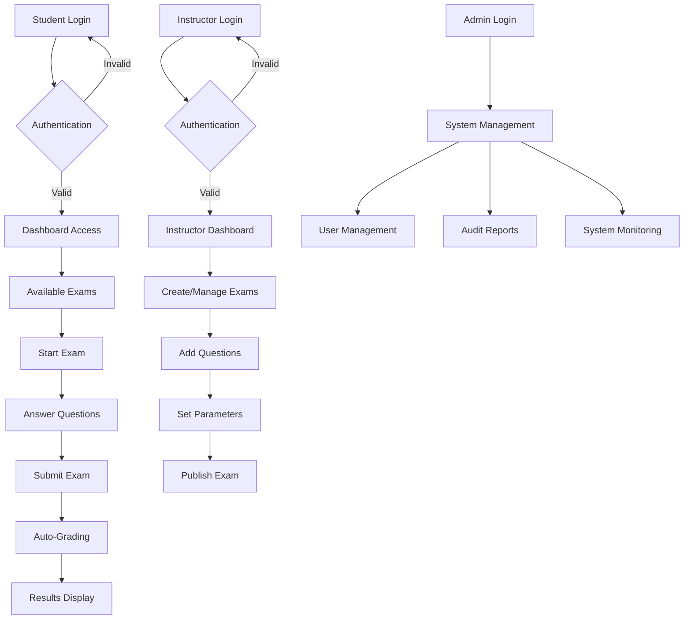

# 🎓 Online Examination System
### Oracle PL/SQL Capstone Project - Database Development

> **A comprehensive Oracle PL/SQL-based online examination platform designed for educational institutions to manage students, instructors, exams, and automated grading with advanced security and auditing features.**

---


## 🎯Problem Statement & Objectives

### 📌 Problem Definition
Educational institutions face significant challenges in conducting fair, secure, and efficient examinations. Traditional paper-based systems are prone to errors, security breaches, and administrative overhead. There's a critical need for a digital solution that can:

- **Automate exam creation and management**
- **Ensure secure student authentication and exam integrity**
- **Provide real-time grading and instant feedback**
- **Maintain comprehensive audit trails for accountability**
- **Support multiple question types (MCQ, Essay)**

### 🎯 Project Goals
- ✅ Develop a robust database system for online examinations
- ✅ Implement secure user authentication and role-based access
- ✅ Create automated grading mechanisms
- ✅ Establish comprehensive audit logging
- ✅ Ensure data integrity and system reliability

### 👥 Target Users
- **Students**: Take exams, view results, track progress
- **Instructors**: Create exams, manage questions, review student performance
- **Administrators**: System management, user oversight, audit review

---

##  Business Process Modeling (MIS Integration)

### 📊 Business Process Flow



### 🏢 Key Business Entities
- **Information Flow**: Student registration → Exam creation → Question management → Exam taking → Result processing
- **Decision Support**: Real-time analytics, performance tracking, audit reporting
- **Process Automation**: Auto-grading, time management, result calculation

---

## 🗄️ Logical Model Design

### 📐 Entity-Relationship Diagram

```
┌─────────────┐    ┌─────────────┐    ┌─────────────┐
│   Student   │    │ Instructor  │    │    Exam     │
├─────────────┤    ├─────────────┤    ├─────────────┤
│ StudentID   │    │InstructorID │    │   ExamID    │
│ FullName    │    │ FullName    │    │   Title     │
│ Email       │    │ Email       │────┤   Subject   │
│ Password    │    │ Password    │    │ StartTime   │
│ Program     │    └─────────────┘    │ EndTime     │
└─────────────┘                       │InstructorID │
       │                              └─────────────┘
       │                                     │
       └─────────────┐                       │
                     │                       │
              ┌─────────────┐         ┌─────────────┐
              │StudentAnswer│         │  Question   │
              ├─────────────┤         ├─────────────┤
              │ StudentID   │         │ QuestionID  │
              │ QuestionID  │─────────│ ExamID      │
              │ OptionID    │         │QuestionText │
              │ AnswerText  │         │QuestionType │
              │ AnsweredAt  │         │   Marks     │
              └─────────────┘         └─────────────┘
                     │                       │
                     │                       │
              ┌─────────────┐         ┌─────────────┐
              │   Result    │         │AnswerOption │
              ├─────────────┤         ├─────────────┤
              │ ResultID    │         │  OptionID   │
              │ StudentID   │         │ QuestionID  │
              │ ExamID      │         │ OptionText  │
              │ Score       │         │ IsCorrect   │
              │SubmittedAt  │         └─────────────┘
              └─────────────┘
```

### 🔑 Key Relationships
- **One-to-Many**: Instructor → Exams, Exam → Questions, Question → AnswerOptions
- **Many-to-Many**: Students ↔ Exams (through StudentAnswer and Result)
- **Referential Integrity**: All foreign key constraints properly defined

---

## 💾 Database Creation & Implementation


### 🛠️ Database User Setup


---

## 🏗️  Table Implementation
# Table creation 


### ⚙️ OEM Configuration


## 🎯 Key Achievements & Learning Outcomes

### ✅ Technical Accomplishments
- **Database Design**: Implemented normalized database structure following 3NF principles
- **PL/SQL Programming**: Created comprehensive procedures, functions, and packages
- **Security Implementation**: Advanced trigger-based security with audit logging
- **Performance Optimization**: Utilized window functions and analytical queries
- **Enterprise Management**: Configured and utilized Oracle Enterprise Manager

### 🧠 Skills Demonstrated
- **Database Modeling**: Entity-relationship design and normalization
- **Advanced SQL**: Complex queries, window functions, analytical functions
- **PL/SQL Development**: Stored procedures, functions, packages, triggers
- **Security Management**: Access control, audit trails, restriction enforcement
- **Performance Monitoring**: OEM configuration and database monitoring
- **Project Management**: Multi-phase development with proper documentation

### 📊 System Capabilities
- **User Management**: Secure registration and authentication
- **Exam Administration**: Complete exam lifecycle management
- **Automated Grading**: Real-time score calculation and ranking
- **Comprehensive Auditing**: Full activity logging and compliance
- **Analytics & Reporting**: Advanced performance analytics and insights
- **Security Enforcement**: Weekend/holiday restrictions and access control

---

## 🔮 Future Enhancements

### 🚀 Potential Improvements
- **Web Interface**: Develop web-based frontend using Oracle APEX
- **Mobile Application**: Create mobile app for exam taking
- **Advanced Analytics**: Machine learning for performance prediction
- **Integration**: Connect with existing student information systems
- **Scalability**: Implement partitioning for large-scale deployments
- **Security**: Add biometric authentication and advanced encryption


## 📜 License & Acknowledgments

### 🙏 Acknowledgments
- **Eric Maniraguha** - Course Instructor and Project Supervisor
- **AUCA Faculty of IT** - Technical guidance and resources
- **Oracle Corporation** - Database management system and documentation
- **Classmates** - Peer review and collaborative learning

### 📋 References
1. Oracle Database Documentation - PL/SQL Programming
2. Database Systems: The Complete Book - Hector Garcia-Molina
3. Oracle Enterprise Manager Cloud Control Administration
4. Business Process Model and Notation (BPMN) Standards
5. Academic Project Guidelines - AUCA Faculty of IT

---

## 🎓 Project Conclusion

This Online Examination System represents a comprehensive solution for educational institutions seeking to modernize their examination processes. The project successfully demonstrates:

- **Complete Database Lifecycle**: From conception to implementation and monitoring
- **Advanced PL/SQL Programming**: Sophisticated database programming techniques
- **Enterprise-Level Security**: Comprehensive audit trails and access controls
- **Performance Optimization**: Efficient queries and analytical capabilities
- **Professional Documentation**: Industry-

> © 2025 Divine Mutuyimana | AUCA | Database Design & Implementation
