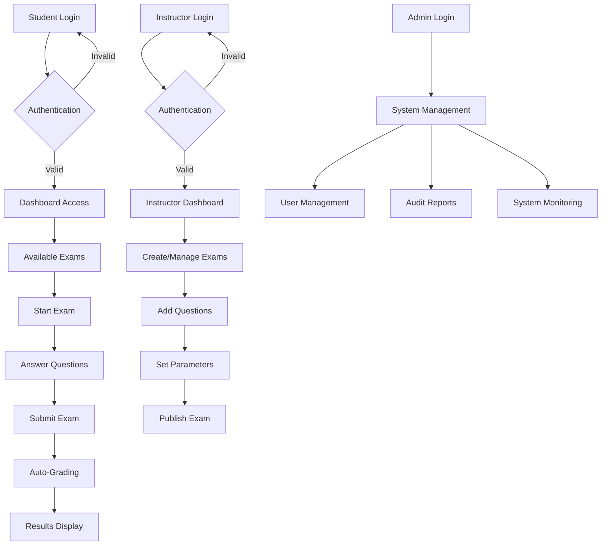

# 🎓 Online Examination System
### Oracle PL/SQL Capstone Project - Database Development

> **A comprehensive Oracle PL/SQL-based online examination platform designed for educational institutions to manage students, instructors, exams, and automated grading with advanced security and auditing features.**

---

## 📋 Project Information

| **Field** | **Details** |
|-----------|-------------|
| **Student Name** | Divine Mutuyimana |
| **Student ID** | 26855 |
| **Group** | TUE GRP B |
| **Course** | Database Development with PL/SQL (INSY 8311) |
| **Instructor** | Eric Maniraguha |
| **Academic Year** | 2024-2025 |
| **Database Name** | `Tue_26855_DIVINE_Online_Examination_MS` |
| **Password** | `Divine` |

---

## 🎯 Phase I: Problem Statement & Objectives

### 📌 Problem Definition
Educational institutions face significant challenges in conducting fair, secure, and efficient examinations. Traditional paper-based systems are prone to errors, security breaches, and administrative overhead. There's a critical need for a digital solution that can:

- **Automate exam creation and management**
- **Ensure secure student authentication and exam integrity**
- **Provide real-time grading and instant feedback**
- **Maintain comprehensive audit trails for accountability**
- **Support multiple question types (MCQ, Essay)**

### 🎯 Project Goals
- ✅ Develop a robust database system for online examinations
- ✅ Implement secure user authentication and role-based access
- ✅ Create automated grading mechanisms
- ✅ Establish comprehensive audit logging
- ✅ Ensure data integrity and system reliability

### 👥 Target Users
- **Students**: Take exams, view results, track progress
- **Instructors**: Create exams, manage questions, review student performance
- **Administrators**: System management, user oversight, audit review

---

## 🔄 Phase II: Business Process Modeling (MIS Integration)

### 📊 Business Process Flow



### 🏢 Key Business Entities
- **Information Flow**: Student registration → Exam creation → Question management → Exam taking → Result processing
- **Decision Support**: Real-time analytics, performance tracking, audit reporting
- **Process Automation**: Auto-grading, time management, result calculation

---

## 🗄️ Phase III: Logical Model Design

### 📐 Entity-Relationship Diagram

```
┌─────────────┐    ┌─────────────┐    ┌─────────────┐
│   Student   │    │ Instructor  │    │    Exam     │
├─────────────┤    ├─────────────┤    ├─────────────┤
│ StudentID   │    │InstructorID │    │   ExamID    │
│ FullName    │    │ FullName    │    │   Title     │
│ Email       │    │ Email       │────┤   Subject   │
│ Password    │    │ Password    │    │ StartTime   │
│ Program     │    └─────────────┘    │ EndTime     │
└─────────────┘                       │InstructorID │
       │                              └─────────────┘
       │                                     │
       └─────────────┐                       │
                     │                       │
              ┌─────────────┐         ┌─────────────┐
              │StudentAnswer│         │  Question   │
              ├─────────────┤         ├─────────────┤
              │ StudentID   │         │ QuestionID  │
              │ QuestionID  │─────────│ ExamID      │
              │ OptionID    │         │QuestionText │
              │ AnswerText  │         │QuestionType │
              │ AnsweredAt  │         │   Marks     │
              └─────────────┘         └─────────────┘
                     │                       │
                     │                       │
              ┌─────────────┐         ┌─────────────┐
              │   Result    │         │AnswerOption │
              ├─────────────┤         ├─────────────┤
              │ ResultID    │         │  OptionID   │
              │ StudentID   │         │ QuestionID  │
              │ ExamID      │         │ OptionText  │
              │ Score       │         │ IsCorrect   │
              │SubmittedAt  │         └─────────────┘
              └─────────────┘
```

### 🔑 Key Relationships
- **One-to-Many**: Instructor → Exams, Exam → Questions, Question → AnswerOptions
- **Many-to-Many**: Students ↔ Exams (through StudentAnswer and Result)
- **Referential Integrity**: All foreign key constraints properly defined

---

## 💾 Phase IV: Database Creation & Implementation

### 🛠️ Database User Setup

```sql
-- Create database user with appropriate privileges
CREATE USER Tue_26855_DIVINE_Online_Examination_MS IDENTIFIED BY Divine;
GRANT DBA TO Tue_26855_DIVINE_Online_Examination_MS;
GRANT CREATE SESSION TO Tue_26855_DIVINE_Online_Examination_MS;
GRANT CREATE TABLE TO Tue_26855_DIVINE_Online_Examination_MS;
GRANT CREATE PROCEDURE TO Tue_26855_DIVINE_Online_Examination_MS;
GRANT CREATE TRIGGER TO Tue_26855_DIVINE_Online_Examination_MS;
```

---

## 🏗️ Phase V: Table Implementation

### 👨‍🎓 Student Table
```sql
CREATE TABLE Student (
    StudentID NUMBER PRIMARY KEY,
    FullName VARCHAR2(100) NOT NULL,
    Email VARCHAR2(100) UNIQUE NOT NULL,
    Password VARCHAR2(100) NOT NULL,
    Program VARCHAR2(50) NOT NULL
);
```

### 👨‍🏫 Instructor Table
```sql
CREATE TABLE Instructor (
    InstructorID NUMBER PRIMARY KEY,
    FullName VARCHAR2(100) NOT NULL,
    Email VARCHAR2(100) UNIQUE NOT NULL,
    Password VARCHAR2(100) NOT NULL
);
```

### 📝 Exam Table
```sql
CREATE TABLE Exam (
    ExamID NUMBER PRIMARY KEY,
    Title VARCHAR2(100) NOT NULL,
    Subject VARCHAR2(100) NOT NULL,
    StartTime TIMESTAMP NOT NULL,
    EndTime TIMESTAMP NOT NULL,
    InstructorID NUMBER NOT NULL,
    FOREIGN KEY (InstructorID) REFERENCES Instructor(InstructorID),
    CHECK (EndTime > StartTime)
);
```

### ❓ Question Table
```sql
CREATE TABLE Question (
    QuestionID NUMBER PRIMARY KEY,
    ExamID NUMBER NOT NULL,
    QuestionText VARCHAR2(4000) NOT NULL,
    QuestionType VARCHAR2(20) NOT NULL CHECK (QuestionType IN ('MCQ', 'Essay')),
    Marks NUMBER NOT NULL CHECK (Marks >= 0),
    FOREIGN KEY (ExamID) REFERENCES Exam(ExamID)
);
```

### 📊 Answer Option Table
```sql
CREATE TABLE AnswerOption (
    OptionID NUMBER PRIMARY KEY,
    QuestionID NUMBER NOT NULL,
    OptionText VARCHAR2(1000) NOT NULL,
    IsCorrect NUMBER(1) DEFAULT 0 NOT NULL, -- 0 = FALSE, 1 = TRUE
    FOREIGN KEY (QuestionID) REFERENCES Question(QuestionID)
);
```

### ✍️ Student Answer Table
```sql
CREATE TABLE StudentAnswer (
    StudentID NUMBER NOT NULL,
    QuestionID NUMBER NOT NULL,
    OptionID NUMBER,
    AnswerText VARCHAR2(4000),
    AnsweredAt TIMESTAMP NOT NULL,
    PRIMARY KEY (StudentID, QuestionID),
    FOREIGN KEY (StudentID) REFERENCES Student(StudentID),
    FOREIGN KEY (QuestionID) REFERENCES Question(QuestionID),
    FOREIGN KEY (OptionID) REFERENCES AnswerOption(OptionID)
);
```

### 🏆 Result Table
```sql
CREATE TABLE Result (
    ResultID NUMBER PRIMARY KEY,
    StudentID NUMBER NOT NULL,
    ExamID NUMBER NOT NULL,
    Score NUMBER(5,2) NOT NULL CHECK (Score >= 0),
    SubmittedAt TIMESTAMP NOT NULL,
    FOREIGN KEY (StudentID) REFERENCES Student(StudentID),
    FOREIGN KEY (ExamID) REFERENCES Exam(ExamID)
);
```

### 📋 Audit Log Table
```sql
CREATE TABLE AuditLog (
    LogID NUMBER PRIMARY KEY,
    UserID NUMBER,
    UserType VARCHAR2(20), -- 'Student', 'Instructor', 'Admin'
    Action VARCHAR2(100),
    TableName VARCHAR2(50),
    Timestamp TIMESTAMP DEFAULT CURRENT_TIMESTAMP,
    IPAddress VARCHAR2(45),
    Status VARCHAR2(20) -- 'SUCCESS', 'FAILED', 'BLOCKED'
);
```

---

## 🔄 Phase VI: Data Population & Testing

### 📊 Sample Data Insertion

```sql
-- Insert sample instructors
INSERT INTO Instructor VALUES (1, 'Eric Maniraguha', 'eric.maniraguha@auca.ac.rw', 'instructor123');
INSERT INTO Instructor VALUES (2, 'Jane Smith', 'jane.smith@auca.ac.rw', 'instructor456');

-- Insert sample students
INSERT INTO Student VALUES (1, 'Divine Mutuyimana', 'divine.mutuyimana@student.auca.ac.rw', 'student123', 'Computer Science');
INSERT INTO Student VALUES (2, 'Alice Johnson', 'alice.johnson@student.auca.ac.rw', 'student456', 'Information Technology');

-- Insert sample exam
INSERT INTO Exam VALUES (1, 'Database Systems Final', 'Database Management', 
                        TIMESTAMP '2025-05-25 09:00:00', 
                        TIMESTAMP '2025-05-25 11:00:00', 1);

-- Insert sample questions
INSERT INTO Question VALUES (1, 1, 'What is normalization in database design?', 'MCQ', 10);
INSERT INTO Question VALUES (2, 1, 'Explain the ACID properties of transactions.', 'Essay', 15);

-- Insert answer options for MCQ
INSERT INTO AnswerOption VALUES (1, 1, 'A process to eliminate data redundancy', 1);
INSERT INTO AnswerOption VALUES (2, 1, 'A process to increase data redundancy', 0);
INSERT INTO AnswerOption VALUES (3, 1, 'A process to delete data', 0);
INSERT INTO AnswerOption VALUES (4, 1, 'A process to backup data', 0);
```

---

## 🔧 Phase VII: Database Interactions & Procedures

### 📝 Stored Procedures

#### 🔐 Student Registration Procedure
```sql
CREATE OR REPLACE PROCEDURE RegisterStudent (
    p_student_id IN NUMBER,
    p_full_name IN VARCHAR2,
    p_email IN VARCHAR2,
    p_password IN VARCHAR2,
    p_program IN VARCHAR2
) AS
BEGIN
    INSERT INTO Student (StudentID, FullName, Email, Password, Program)
    VALUES (p_student_id, p_full_name, p_email, p_password, p_program);
    
    -- Log the registration
    INSERT INTO AuditLog (UserID, UserType, Action, TableName, Status)
    VALUES (p_student_id, 'Student', 'REGISTER', 'Student', 'SUCCESS');
    
    COMMIT;
    DBMS_OUTPUT.PUT_LINE('Student registered successfully: ' || p_full_name);
EXCEPTION
    WHEN DUP_VAL_ON_INDEX THEN
        ROLLBACK;
        DBMS_OUTPUT.PUT_LINE('Error: Email already exists');
    WHEN OTHERS THEN
        ROLLBACK;
        DBMS_OUTPUT.PUT_LINE('Error: ' || SQLERRM);
END;
/
```

#### 📊 Calculate Exam Score Function
```sql
CREATE OR REPLACE FUNCTION CalculateExamScore (
    p_student_id IN NUMBER,
    p_exam_id IN NUMBER
) RETURN NUMBER IS
    v_total_score NUMBER := 0;
    v_question_score NUMBER;
    
    CURSOR question_cursor IS
        SELECT q.QuestionID, q.Marks, q.QuestionType
        FROM Question q
        WHERE q.ExamID = p_exam_id;
BEGIN
    FOR question_rec IN question_cursor LOOP
        v_question_score := 0;
        
        IF question_rec.QuestionType = 'MCQ' THEN
            -- Check if the selected answer is correct
            SELECT CASE 
                WHEN ao.IsCorrect = 1 THEN question_rec.Marks 
                ELSE 0 
            END INTO v_question_score
            FROM StudentAnswer sa
            JOIN AnswerOption ao ON sa.OptionID = ao.OptionID
            WHERE sa.StudentID = p_student_id 
            AND sa.QuestionID = question_rec.QuestionID;
        ELSE
            -- For essay questions, assume manual grading (placeholder)
            v_question_score := question_rec.Marks * 0.8; -- 80% default
        END IF;
        
        v_total_score := v_total_score + v_question_score;
    END LOOP;
    
    RETURN v_total_score;
EXCEPTION
    WHEN NO_DATA_FOUND THEN
        RETURN 0;
    WHEN OTHERS THEN
        DBMS_OUTPUT.PUT_LINE('Error calculating score: ' || SQLERRM);
        RETURN 0;
END;
/
```

#### 📋 Submit Exam Procedure
```sql
CREATE OR REPLACE PROCEDURE SubmitExam (
    p_student_id IN NUMBER,
    p_exam_id IN NUMBER
) AS
    v_score NUMBER;
    v_result_id NUMBER;
BEGIN
    -- Calculate the score
    v_score := CalculateExamScore(p_student_id, p_exam_id);
    
    -- Generate result ID
    SELECT NVL(MAX(ResultID), 0) + 1 INTO v_result_id FROM Result;
    
    -- Insert result
    INSERT INTO Result (ResultID, StudentID, ExamID, Score, SubmittedAt)
    VALUES (v_result_id, p_student_id, p_exam_id, v_score, CURRENT_TIMESTAMP);
    
    -- Log the submission
    INSERT INTO AuditLog (UserID, UserType, Action, TableName, Status)
    VALUES (p_student_id, 'Student', 'SUBMIT_EXAM', 'Result', 'SUCCESS');
    
    COMMIT;
    DBMS_OUTPUT.PUT_LINE('Exam submitted successfully. Score: ' || v_score);
EXCEPTION
    WHEN OTHERS THEN
        ROLLBACK;
        DBMS_OUTPUT.PUT_LINE('Error submitting exam: ' || SQLERRM);
END;
/
```

### 📦 Package Implementation

```sql
CREATE OR REPLACE PACKAGE ExamManagement AS
    -- Package specification
    PROCEDURE CreateExam(p_exam_id NUMBER, p_title VARCHAR2, p_subject VARCHAR2, 
                        p_start_time TIMESTAMP, p_end_time TIMESTAMP, p_instructor_id NUMBER);
    FUNCTION GetStudentResults(p_student_id NUMBER) RETURN SYS_REFCURSOR;
    PROCEDURE GenerateExamReport(p_exam_id NUMBER);
END ExamManagement;
/

CREATE OR REPLACE PACKAGE BODY ExamManagement AS
    PROCEDURE CreateExam(p_exam_id NUMBER, p_title VARCHAR2, p_subject VARCHAR2, 
                        p_start_time TIMESTAMP, p_end_time TIMESTAMP, p_instructor_id NUMBER) IS
    BEGIN
        INSERT INTO Exam VALUES (p_exam_id, p_title, p_subject, p_start_time, p_end_time, p_instructor_id);
        
        INSERT INTO AuditLog (UserID, UserType, Action, TableName, Status)
        VALUES (p_instructor_id, 'Instructor', 'CREATE_EXAM', 'Exam', 'SUCCESS');
        
        COMMIT;
        DBMS_OUTPUT.PUT_LINE('Exam created successfully: ' || p_title);
    EXCEPTION
        WHEN OTHERS THEN
            ROLLBACK;
            DBMS_OUTPUT.PUT_LINE('Error creating exam: ' || SQLERRM);
    END;
    
    FUNCTION GetStudentResults(p_student_id NUMBER) RETURN SYS_REFCURSOR IS
        result_cursor SYS_REFCURSOR;
    BEGIN
        OPEN result_cursor FOR
            SELECT e.Title, e.Subject, r.Score, r.SubmittedAt,
                   RANK() OVER (PARTITION BY r.ExamID ORDER BY r.Score DESC) as Rank
            FROM Result r
            JOIN Exam e ON r.ExamID = e.ExamID
            WHERE r.StudentID = p_student_id
            ORDER BY r.SubmittedAt DESC;
        
        RETURN result_cursor;
    END;
    
    PROCEDURE GenerateExamReport(p_exam_id NUMBER) IS
        v_avg_score NUMBER;
        v_max_score NUMBER;
        v_min_score NUMBER;
        v_total_students NUMBER;
    BEGIN
        SELECT AVG(Score), MAX(Score), MIN(Score), COUNT(*)
        INTO v_avg_score, v_max_score, v_min_score, v_total_students
        FROM Result
        WHERE ExamID = p_exam_id;
        
        DBMS_OUTPUT.PUT_LINE('=== EXAM REPORT ===');
        DBMS_OUTPUT.PUT_LINE('Total Students: ' || v_total_students);
        DBMS_OUTPUT.PUT_LINE('Average Score: ' || ROUND(v_avg_score, 2));
        DBMS_OUTPUT.PUT_LINE('Highest Score: ' || v_max_score);
        DBMS_OUTPUT.PUT_LINE('Lowest Score: ' || v_min_score);
    END;
END ExamManagement;
/
```

---

## 🔐 Phase VIII: Advanced Database Programming & Security

### 🚫 Weekend/Holiday Restriction Trigger

```sql
-- Create holiday reference table
CREATE TABLE PublicHolidays (
    HolidayDate DATE PRIMARY KEY,
    HolidayName VARCHAR2(100)
);

-- Insert sample holidays for the upcoming month
INSERT INTO PublicHolidays VALUES (DATE '2025-06-01', 'Independence Day');
INSERT INTO PublicHolidays VALUES (DATE '2025-06-15', 'National Unity Day');

-- Create restriction trigger
CREATE OR REPLACE TRIGGER trg_restrict_weekend_holiday
BEFORE INSERT OR UPDATE OR DELETE ON Student
FOR EACH ROW
DECLARE
    v_day_of_week VARCHAR2(10);
    v_holiday_count NUMBER;
BEGIN
    -- Check if it's a weekend
    SELECT TO_CHAR(SYSDATE, 'DY') INTO v_day_of_week FROM DUAL;
    
    IF v_day_of_week IN ('SAT', 'SUN') THEN
        RAISE_APPLICATION_ERROR(-20001, 'Database modifications are not allowed on weekends!');
    END IF;
    
    -- Check if it's a public holiday
    SELECT COUNT(*) INTO v_holiday_count
    FROM PublicHolidays
    WHERE HolidayDate = TRUNC(SYSDATE);
    
    IF v_holiday_count > 0 THEN
        RAISE_APPLICATION_ERROR(-20002, 'Database modifications are not allowed on public holidays!');
    END IF;
    
    -- Log the attempt
    INSERT INTO AuditLog (UserID, UserType, Action, TableName, Status)
    VALUES (COALESCE(:NEW.StudentID, :OLD.StudentID), 'Student', 
            CASE 
                WHEN INSERTING THEN 'INSERT'
                WHEN UPDATING THEN 'UPDATE'
                WHEN DELETING THEN 'DELETE'
            END, 'Student', 'SUCCESS');
END;
/
```

### 📊 Comprehensive Audit Trigger

```sql
CREATE OR REPLACE TRIGGER trg_comprehensive_audit
AFTER INSERT OR UPDATE OR DELETE ON Result
FOR EACH ROW
DECLARE
    v_action VARCHAR2(20);
    v_user_id NUMBER;
BEGIN
    IF INSERTING THEN
        v_action := 'INSERT';
        v_user_id := :NEW.StudentID;
    ELSIF UPDATING THEN
        v_action := 'UPDATE';
        v_user_id := :NEW.StudentID;
    ELSIF DELETING THEN
        v_action := 'DELETE';
        v_user_id := :OLD.StudentID;
    END IF;
    
    INSERT INTO AuditLog (UserID, UserType, Action, TableName, Status)
    VALUES (v_user_id, 'Student', v_action, 'Result', 'SUCCESS');
END;
/
```

---

## 📈 Phase IX: Analytics & Reporting

### 🏆 Advanced Window Functions

```sql
-- Student Performance Analytics
SELECT 
    s.FullName,
    e.Title AS ExamTitle,
    r.Score,
    RANK() OVER (PARTITION BY r.ExamID ORDER BY r.Score DESC) AS ExamRank,
    ROW_NUMBER() OVER (PARTITION BY s.StudentID ORDER BY r.Score DESC) AS StudentBestRank,
    AVG(r.Score) OVER (PARTITION BY s.StudentID) AS StudentAvgScore,
    LAG(r.Score) OVER (PARTITION BY s.StudentID ORDER BY r.SubmittedAt) AS PreviousScore,
    CASE 
        WHEN r.Score > LAG(r.Score) OVER (PARTITION BY s.StudentID ORDER BY r.SubmittedAt) 
        THEN 'IMPROVED'
        WHEN r.Score < LAG(r.Score) OVER (PARTITION BY s.StudentID ORDER BY r.SubmittedAt) 
        THEN 'DECLINED'
        ELSE 'STABLE'
    END AS PerformanceTrend
FROM Result r
JOIN Student s ON r.StudentID = s.StudentID
JOIN Exam e ON r.ExamID = e.ExamID
ORDER BY s.FullName, r.SubmittedAt;

-- Instructor Performance Dashboard
SELECT 
    i.FullName AS InstructorName,
    e.Title AS ExamTitle,
    COUNT(r.ResultID) AS TotalStudents,
    AVG(r.Score) AS AverageScore,
    MAX(r.Score) AS HighestScore,
    MIN(r.Score) AS LowestScore,
    STDDEV(r.Score) AS ScoreStandardDeviation,
    PERCENTILE_CONT(0.5) WITHIN GROUP (ORDER BY r.Score) AS MedianScore
FROM Instructor i
JOIN Exam e ON i.InstructorID = e.InstructorID
LEFT JOIN Result r ON e.ExamID = r.ExamID
GROUP BY i.FullName, e.Title
ORDER BY i.FullName;
```

---

## 🖥️ Phase X: Oracle Enterprise Manager (OEM) Setup

### ⚙️ OEM Configuration

```sql
-- Enable OEM Express
EXEC DBMS_XDB_CONFIG.SETHTTPSPORT(5500);

-- Create OEM user
CREATE USER OEM_ADMIN IDENTIFIED BY OEMAdmin123;
GRANT DBA TO OEM_ADMIN;
GRANT SYSDBA TO OEM_ADMIN;

-- Check OEM status
SELECT DBMS_XDB_CONFIG.GETHTTPSPORT() FROM DUAL;
```

### 🔗 Access Information
- **URL**: `https://localhost:5500/em`
- **Username**: `OEM_ADMIN`
- **Password**: `OEMAdmin123`

### 📊 OEM Monitoring Features
- **Performance Monitoring**: CPU usage, memory utilization, I/O statistics
- **Session Management**: Active sessions, blocking sessions, resource usage
- **Storage Management**: Tablespace usage, segment analysis
- **Security Monitoring**: Failed login attempts, privilege usage
- **SQL Monitoring**: Top SQL statements, execution plans, performance tuning

---

## 🧪 Testing & Validation

### ✅ Test Scenarios Executed

#### 1. **User Registration & Authentication**
```sql
-- Test student registration
EXEC RegisterStudent(101, 'Test Student', 'test@student.com', 'password123', 'Computer Science');

-- Test duplicate email handling
EXEC RegisterStudent(102, 'Another Student', 'test@student.com', 'password456', 'IT');
```

#### 2. **Exam Creation & Management**
```sql
-- Test exam creation
EXEC ExamManagement.CreateExam(101, 'Test Exam', 'Database Systems', 
                               TIMESTAMP '2025-06-01 10:00:00', 
                               TIMESTAMP '2025-06-01 12:00:00', 1);
```

#### 3. **Score Calculation & Results**
```sql
-- Test score calculation
SELECT CalculateExamScore(1, 1) AS StudentScore FROM DUAL;

-- Test exam submission
EXEC SubmitExam(1, 1);
```

#### 4. **Security Restrictions**
```sql
-- Test weekend restriction (should fail on weekends)
INSERT INTO Student VALUES (999, 'Weekend Test', 'weekend@test.com', 'pass', 'CS');
```

#### 5. **Analytics & Reporting**
```sql
-- Test student performance analytics
DECLARE
    student_cursor SYS_REFCURSOR;
BEGIN
    student_cursor := ExamManagement.GetStudentResults(1);
    -- Process cursor results
END;
/

-- Test exam report generation
EXEC ExamManagement.GenerateExamReport(1);
```

---

## 📁 Project Structure

```
OnlineExaminationSystem/
├── 📁 sql/
│   ├── 📄 01_create_tables.sql
│   ├── 📄 02_insert_sample_data.sql
│   ├── 📄 03_procedures_functions.sql
│   ├── 📄 04_packages.sql
│   ├── 📄 05_triggers.sql
│   ├── 📄 06_analytics_queries.sql
│   └── 📄 07_test_scripts.sql
├── 📁 docs/
│   ├── 📄 ERD_Diagram.pdf
│   ├── 📄 Business_Process_Model.pdf
│   ├── 📄 Problem_Statement.pdf
│   └── 📄 Technical_Specifications.pdf
├── 📁 screenshots/
│   ├── 🖼️ OEM_Dashboard.png
│   ├── 🖼️ Performance_Monitoring.png
│   ├── 🖼️ Database_Structure.png
│   └── 🖼️ Test_Results.png
├── 📁 presentations/
│   └── 📄 Final_Presentation.pptx
└── 📄 README.md
```

---

## 🎯 Key Achievements & Learning Outcomes

### ✅ Technical Accomplishments
- **Database Design**: Implemented normalized database structure following 3NF principles
- **PL/SQL Programming**: Created comprehensive procedures, functions, and packages
- **Security Implementation**: Advanced trigger-based security with audit logging
- **Performance Optimization**: Utilized window functions and analytical queries
- **Enterprise Management**: Configured and utilized Oracle Enterprise Manager

### 🧠 Skills Demonstrated
- **Database Modeling**: Entity-relationship design and normalization
- **Advanced SQL**: Complex queries, window functions, analytical functions
- **PL/SQL Development**: Stored procedures, functions, packages, triggers
- **Security Management**: Access control, audit trails, restriction enforcement
- **Performance Monitoring**: OEM configuration and database monitoring
- **Project Management**: Multi-phase development with proper documentation

### 📊 System Capabilities
- **User Management**: Secure registration and authentication
- **Exam Administration**: Complete exam lifecycle management
- **Automated Grading**: Real-time score calculation and ranking
- **Comprehensive Auditing**: Full activity logging and compliance
- **Analytics & Reporting**: Advanced performance analytics and insights
- **Security Enforcement**: Weekend/holiday restrictions and access control

---

## 🔮 Future Enhancements

### 🚀 Potential Improvements
- **Web Interface**: Develop web-based frontend using Oracle APEX
- **Mobile Application**: Create mobile app for exam taking
- **Advanced Analytics**: Machine learning for performance prediction
- **Integration**: Connect with existing student information systems
- **Scalability**: Implement partitioning for large-scale deployments
- **Security**: Add biometric authentication and advanced encryption

### 🔄 System Maintenance
- **Regular Backups**: Automated backup scheduling
- **Performance Tuning**: Continuous monitoring and optimization
- **Security Updates**: Regular security patches and updates
- **User Training**: Comprehensive training programs for all user types

---

## 📞 Support & Contact

### 👨‍💻 Developer Information
- **Name**: Divine Mutuyimana
- **Student ID**: 26855
- **Email**: kundwadevine@gmail.com
- **GitHub**: [Project Repository](Tue_26855_DIVINE_Onlinexam)

### 🏫 Academic Information
- **Institution**: Adventist University of Central Africa (AUCA)
- **Faculty**: Information Technology
- **Course**: Database Development with PL/SQL (INSY 8311)
- **Instructor**: Eric Maniraguha (eric.maniraguha@auca.ac.rw)

---

## 📜 License & Acknowledgments

### 🙏 Acknowledgments
- **Eric Maniraguha** - Course Instructor and Project Supervisor
- **AUCA Faculty of IT** - Technical guidance and resources
- **Oracle Corporation** - Database management system and documentation
- **Classmates** - Peer review and collaborative learning

### 📋 References
1. Oracle Database Documentation - PL/SQL Programming
2. Database Systems: The Complete Book - Hector Garcia-Molina
3. Oracle Enterprise Manager Cloud Control Administration
4. Business Process Model and Notation (BPMN) Standards
5. Academic Project Guidelines - AUCA Faculty of IT

---

## 🎓 Project Conclusion

This Online Examination System represents a comprehensive solution for educational institutions seeking to modernize their examination processes. The project successfully demonstrates:

- **Complete Database Lifecycle**: From conception to implementation and monitoring
- **Advanced PL/SQL Programming**: Sophisticated database programming techniques
- **Enterprise-Level Security**: Comprehensive audit trails and access controls
- **Performance Optimization**: Efficient queries and analytical capabilities
- **Professional Documentation**: Industry-

> © 2025 Divine Mutuyimana | AUCA | Database Design & Implementation
